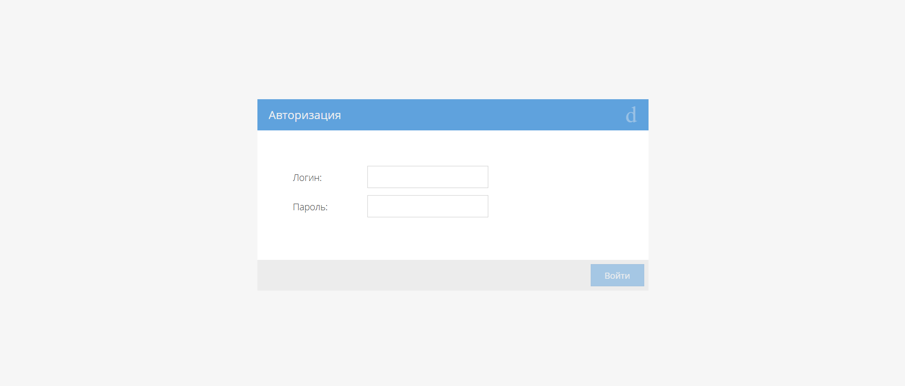
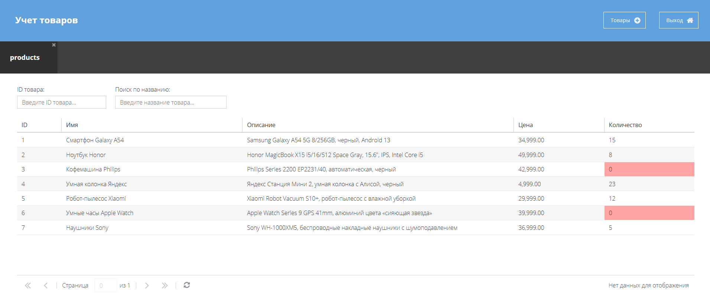

# TradeApp-ExtJS (JavaScript / ExtJS)

## Обзор 🌟

Приложение для управления товарами, разработанное на ExtJS. Включает в себя систему авторизации, табличное представление товаров с возможностью поиска и сортировки, а также детальные карточки товаров с функционалом редактирования. Интерфейс построен с использованием компонентов ExtJS, обеспечивающих единый стиль оформления и удобство использования.

### [Посмотреть демо](https://subbotinroman.github.io/TradeApp-ExtJS/) 👈





---

## Стек технологий ⚙️


---

## Возможности 🚀

- 🔐 Форма авторизации с валидацией логина и пароля
- 📋 Таблица товаров с возможностью сортировки по колонкам
- 🔍 Поиск товаров:
  - По ID товара
  - По названию товара
- 📝 Карточка товара с возможностью:
  - Просмотра детальной информации
  - Редактирования данных
  - Сохранения изменений
- ↩️ Возможность выхода из системы

---

## Предварительные требования 🔧

### 1. Установка Sencha CMD

1. Скачайте Sencha CMD для Windows 64-bit по этой [ссылке](https://www.sencha.com/products/sencha-cmd/)
2. После скачивания:
   - Распакуйте zip архив
   - Найдите и запустите установщик `SenchaCmd-7.7.0.45-windows-x64.exe`
   - Следуйте инструкциям установщика

### 2. Установка ExtJS SDK
Скачайте [ExtJS SDK](https://www.sencha.com/products/extjs/evaluate/)

Для Windows создайте директорию и распакуйте SDK:
```bash
mkdir C:\bin\Sencha\ext-7.7.0
```
Распакуйте скачанный SDK в эту директорию.

---

## Установка и запуск проекта 💻

1. Склонируйте репозиторий
```bash
git clone https://github.com/SubbotinRoman/TradeApp-ExtJS.git
```

2. Перейдите в директорию проекта
```bash
cd TradeApp-ExtJS
```

3. Установите зависимости через npm
```bash
npm install
```

4. Обновите зависимости проекта и пути к SDK
```bash
sencha app upgrade
```

5. Запустите локальный сервер разработки
```bash
sencha app watch
```

После запуска откройте браузер и перейдите по адресу:
```
http://localhost:1841/
```
